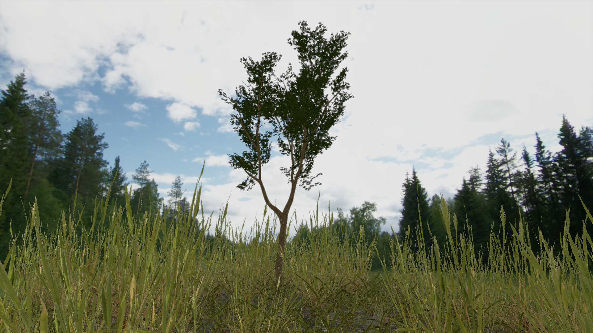

# josh3d

Josh3d (pronounced as "joe shed") is a small 3D rendering engine written in OpenGL 4.3 and C++20.

It's mainly a hobby project and is a constant work in progress so there's no stable version. The scope is limited by my abilities and the free time that I have, but I do try to keep everything clean and even write comments sometimes, so you're welcome to poke around in code if you want. It also serves as the prototyping grounds for trying different techniques, thanks to the extendable and hook-able architecture the engine has.

Here's some pictures because you probably like to look at things:



> Tree asset by [SomeKevin on sketchfab](https://sketchfab.com/3d-models/tree-66a8d0ef9b49415a9eaf6af216cb9bce), Grass by [3dhdscan on sketchfab](https://sketchfab.com/3d-models/simple-grass-chunks-eb4f6dc9d4e3455ea3435385faf58b60), Skybox by [Emil Persson (aka. Humus) from humus.name](https://www.humus.name/index.php?page=Textures)


## Currently Implemented Features:

### Rendering:

- Deferred renderer with Blinn-Phong shading;
- Directional and point lights with shadow mapping;
- Normal maps;
- Soft gaussian bloom;
- Gamma Correction and HDR with adaptive exposure.

### Engine:

- ECS based engine design written to accomodate minimal shader switching and minimize "late-bound" decision making;
- Support for adding custom rendering and postprocessing passes to the engine. Nothing is "nailed-down", everything can be extended or replaced by a user-provided solution;
- ImGui hooks for configuring rendering passes and manipulating registry components.


## Road Ahead (TODOs):

(items in each section are listed in order of priority)

### Rendering:

- Cascaded shadow mapping;
- SSAO;
- PBR support;
- Some global illumination solution;
- More grass, I like grass.

### Engine:

- Support for precompute passes;
- Frustrum culling;
- Compute-based particle system;
- Instancing, indirect draws and tricks to scale up to larger scenes.

### Assets and IO:

- Virtual filesystem with multiple-root and overriding support;
- Asynchronous asset loading with caching;
- High-level asset management system;
- Serialization (binary ECS dump + custom schema)

### Other:

- Package the project so that it could be used as a dependency through FetchContent or similar.

# Requirements & Dependencies

__Requires:__ C++20 Compiler, [CMake 3.21](https://cmake.org), [vcpkg](https://github.com/microsoft/vcpkg)

__Depends on:__
[glbinding](https://github.com/cginternals/glbinding),
[glfw](https://github.com/glfw/glfw),
[glfwpp](https://github.com/janekb04/glfwpp),
[glm](https://github.com/g-truc/glm),
[assimp](https://github.com/assimp/assimp),
[stb](https://github.com/nothings/stb),
[range-v3](https://github.com/ericniebler/range-v3),
[entt](https://github.com/skypjack/entt),
[dear imgui](https://github.com/ocornut/imgui),
[doctest](https://github.com/doctest/doctest)

All dependencies are satisfied automatically with vcpkg or FetchContent.

# Build & Run

Configure and build from the project root:

```
VCPKG_ROOT=[path to vcpkg]
CMAKE_TOOLCHAIN_FILE=${VCPKG_ROOT}/scripts/buildsystems/vcpkg.cmake
mkdir build
cmake -S . -B build
cmake --build build
```

Run the demo and tests from the project root.

# Q: Who is Josh?

Josh is a slimy, leopard colored, striped tree that I made in 15 minutes in blender when I needed an asset to test normal maps. I was so proud of myself at the time, that I decided to dedicate this whole repo (and years of my work) to it.

Here's a pic of Josh taking a nap:


Isn't it cute?
